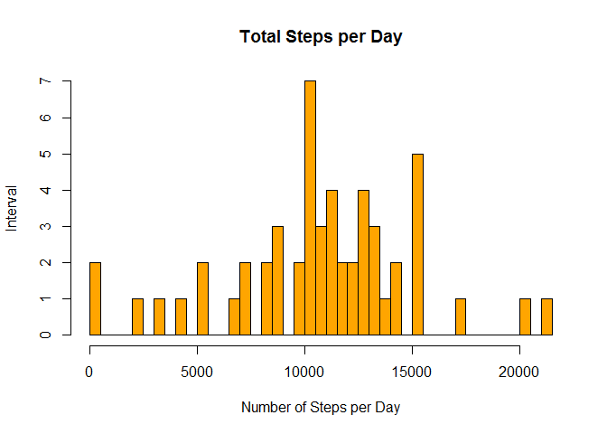
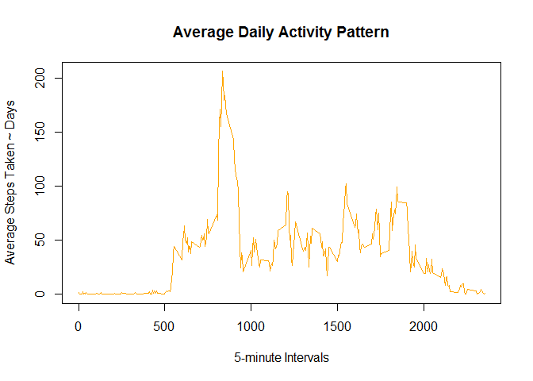
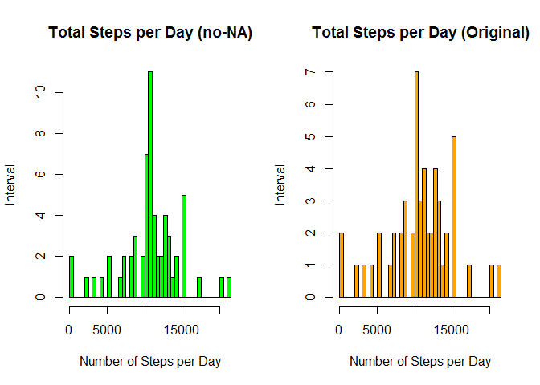
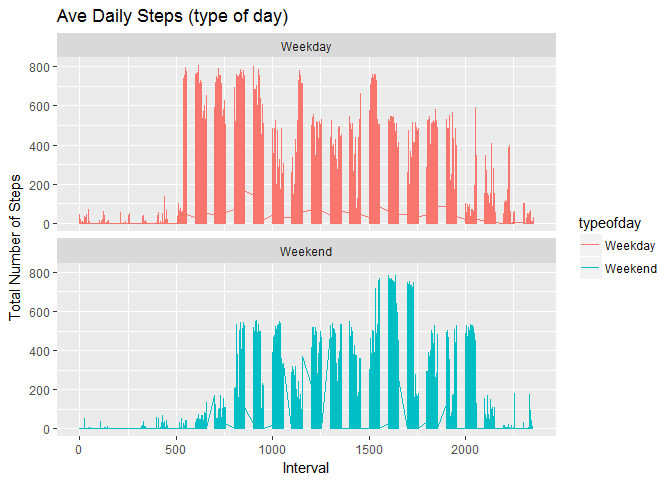

(Reproducible Research)
-----------------------

Introduction

It is now possible to collect a large amount of data about personal
movement using activity monitoring devices such as a Fitbit, Nike
Fuelband, or Jawbone Up. These type of devices are part of the
"quantified self" movement - a group of enthusiasts who take
measurements about themselves regularly to improve their health, to find
patterns in their behavior, or because they are tech geeks. But these
data remain under-utilized both because the raw data are hard to obtain
and there is a lack of statistical methods and software for processing
and interpreting the data.

This assignment makes use of data from a personal activity monitoring
device. This device collects data at 5 minute intervals through out the
day. The data consists of two months of data from an anonymous
individual collected during the months of October and November, 2012 and
include the number of steps taken in 5 minute intervals each day.

### Data

The data for this assignment can be downloaded from the course web site:

Dataset: [Activity monitoring data
\[52K\]](https://d396qusza40orc.cloudfront.net/repdata%2Fdata%2Factivity.zip)
The variables included in this dataset are:

-   **steps**: Number of steps taking in a 5-minute interval (missing
    values are coded as NA).

-   **date**: The date on which the measurement was taken in
    YYYY-MM-DD format.

-   **interval**: Identifier for the 5-minute interval in which
    measurement was taken.

The dataset is stored in a comma-separated-value (CSV) file and there
are a total of 17,568 observations in this dataset.

### Loading and preprocessing the data

    #Required Library
    library(knitr)

    ## Warning: package 'knitr' was built under R version 3.4.1

    library(ggplot2)

    ## Warning: package 'ggplot2' was built under R version 3.4.1

    library(dplyr)

    ## Warning: package 'dplyr' was built under R version 3.4.1

    ## 
    ## Attaching package: 'dplyr'

    ## The following objects are masked from 'package:stats':
    ## 
    ##     filter, lag

    ## The following objects are masked from 'package:base':
    ## 
    ##     intersect, setdiff, setequal, union

    library(plyr)

    ## Warning: package 'plyr' was built under R version 3.4.1

    ## -------------------------------------------------------------------------

    ## You have loaded plyr after dplyr - this is likely to cause problems.
    ## If you need functions from both plyr and dplyr, please load plyr first, then dplyr:
    ## library(plyr); library(dplyr)

    ## -------------------------------------------------------------------------

    ## 
    ## Attaching package: 'plyr'

    ## The following objects are masked from 'package:dplyr':
    ## 
    ##     arrange, count, desc, failwith, id, mutate, rename, summarise,
    ##     summarize

### Download the file, unzip and read the .csv file.

    temp <- tempfile()
    download.file("https://d396qusza40orc.cloudfront.net/repdata%2Fdata%2Factivity.zip", temp, mode="wb")
    unzip(temp, "activity.csv")
    activity <- read.csv("activity.csv",header=T)
    unlink(temp)

1.  Calculate the total number of steps taken per day?

*(For this part of the assignment, you can ignore the missing values in
the dataset.)*

    totalstepsperday <- aggregate(steps ~ date, data = activity, FUN = sum, na.rm = TRUE)
    head(totalstepsperday)

    ##         date steps
    ## 1 2012-10-02   126
    ## 2 2012-10-03 11352
    ## 3 2012-10-04 12116
    ## 4 2012-10-05 13294
    ## 5 2012-10-06 15420
    ## 6 2012-10-07 11015

1.  Make a histogram of the total number of steps taken each day.
    *convert dates first*

<!-- -->

    ## converting dates to Y-M-D format
    activity$date <- as.Date(activity$date, "%Y-%m-%d")
    ## calculate steps as it relates to date using SUM (per day)
    hist(totalstepsperday$steps, 
        main="Total Steps per Day", 
        xlab="Number of Steps per Day", 
        ylab = "Interval",
        col="orange",
        breaks=50)

1.  Calculate and report the mean and median total number of steps taken
    per day.

<!-- -->

    ## mean of total steps per day
    msteps <- mean(totalstepsperday$steps)
    msteps

    ## [1] 10766.19

    ## median of total steps per day
    medsteps <- median(totalstepsperday$steps)
    medsteps

    ## [1] 10765

    ## check work using summary
    summary(totalstepsperday)

    ##          date        steps      
    ##  2012-10-02: 1   Min.   :   41  
    ##  2012-10-03: 1   1st Qu.: 8841  
    ##  2012-10-04: 1   Median :10765  
    ##  2012-10-05: 1   Mean   :10766  
    ##  2012-10-06: 1   3rd Qu.:13294  
    ##  2012-10-07: 1   Max.   :21194  
    ##  (Other)   :47

1.  What is the average daily activity pattern?

Make a time series plot (i.e. type = "l") of the 5-minute interval
(x-axis) and the average number of steps taken, averaged across all days
(y-axis)

    ## five minute average using steps to interval - FUN = mean instead of sum
    fivemin <- aggregate(steps ~ interval, data = activity, FUN = mean, na.rm = TRUE)
    ## line chart
    plot(x = fivemin$interval, 
        y = fivemin$steps, 
        type = "l", 
        col = "orange",
        xlab = "5-minute Intervals",
        ylab = "Average Steps Taken ~ Days",
        main = "Average Daily Activity Pattern")

1.  Which 5-minute interval, on average across all the days in the
    dataset, contains the maximum number of steps?

<!-- -->

    maxsteps <- fivemin$interval[which.max(fivemin$steps)]
    maxsteps

    ## [1] 835

### Imputing missing values

Note that there are a number of days/intervals where there are missing
values (coded as NA). The presence of missing days may introduce bias
into some calculations or summaries of the data.

1.  Calculate and report the total number of missing values in the
    dataset (i.e. the total number of rows with NAs)

Devise a strategy for filling in all of the missing values in the
dataset. The strategy does not need to be sophisticated. For example,
you could use the mean/median for that day, or the mean for that
5-minute interval, etc.

*Replace NA values with the mean results for five minute intervals*
Create a new dataset that is equal to the original dataset but with the
missing data filled in.

    activity2 <- activity
    nas <- is.na(activity2$steps)
    avg_interval <- tapply(activity2$steps, activity2$interval, mean, na.rm=TRUE, simplify = TRUE)
    activity2$steps[nas] <- avg_interval[as.character(activity2$interval[nas])]
    names(activity2)

    ## [1] "steps"    "date"     "interval"

    ## Check for no-NA
    sum(is.na(activity2))

    ## [1] 0

1.  Make a histogram of the total number of steps taken each day and
    Calculate and report the mean and median total number of steps taken
    per day. Do these values differ from the estimates from the first
    part of the assignment? What is the impact of imputing missing data
    on the estimates of the total daily number of steps?

<!-- -->

    #Plotting
    #Setting up the pannel for one row and two columns
    par(mfrow=c(1,2))

    ## Similar analysis without NAs now
    totalstepsperday2 <- aggregate(steps ~ date, data = activity2, FUN = sum, na.rm = TRUE)
    head(totalstepsperday2)

    ##         date    steps
    ## 1 2012-10-01 10766.19
    ## 2 2012-10-02   126.00
    ## 3 2012-10-03 11352.00
    ## 4 2012-10-04 12116.00
    ## 5 2012-10-05 13294.00
    ## 6 2012-10-06 15420.00

    ## Histogram without the NA values
    hist(totalstepsperday2$steps, 
        main = "Total Steps per Day (no-NA)", 
        xlab = "Number of Steps per Day", 
        ylab = "Interval",
        col="green",
        breaks=50)
    ##Histogram with the orginal dataset
    hist(totalstepsperday$steps, 
        main="Total Steps per Day (Original)", 
        xlab="Number of Steps per Day", 
        ylab = "Interval",
        col="orange",
        breaks=50)

    #Resetting the panel
    par(mfrow=c(1,1))
    ## What is the impact of imputing data?
    summary(totalstepsperday)

    ##          date        steps      
    ##  2012-10-02: 1   Min.   :   41  
    ##  2012-10-03: 1   1st Qu.: 8841  
    ##  2012-10-04: 1   Median :10765  
    ##  2012-10-05: 1   Mean   :10766  
    ##  2012-10-06: 1   3rd Qu.:13294  
    ##  2012-10-07: 1   Max.   :21194  
    ##  (Other)   :47

    summary(totalstepsperday2)

    ##       date                steps      
    ##  Min.   :2012-10-01   Min.   :   41  
    ##  1st Qu.:2012-10-16   1st Qu.: 9819  
    ##  Median :2012-10-31   Median :10766  
    ##  Mean   :2012-10-31   Mean   :10766  
    ##  3rd Qu.:2012-11-15   3rd Qu.:12811  
    ##  Max.   :2012-11-30   Max.   :21194

    ## Mean and median values are almost identical, but the quantiles are significantly different.

Are there differences in activity patterns between weekdays and
weekends? For this part the weekdays() function may be of some help
here. Use the dataset with the filled-in missing values for this part.

    ## Data has three fields, and we will add a new one in the next step - 11
    head(activity2)

    ##       steps       date interval
    ## 1 1.7169811 2012-10-01        0
    ## 2 0.3396226 2012-10-01        5
    ## 3 0.1320755 2012-10-01       10
    ## 4 0.1509434 2012-10-01       15
    ## 5 0.0754717 2012-10-01       20
    ## 6 2.0943396 2012-10-01       25

Create a new factor variable in the dataset with two levels - "weekday"
and "weekend" indicating whether a given date is a weekday or weekend
day.

    ## Add the new weekend/weekday field
    activity2<- activity2%>%
            mutate(typeofday= ifelse(weekdays(activity2$date)=="Saturday" | weekdays(activity2$date)=="Sunday", "Weekend", "Weekday"))
    head(activity2)

    ##       steps       date interval typeofday
    ## 1 1.7169811 2012-10-01        0   Weekday
    ## 2 0.3396226 2012-10-01        5   Weekday
    ## 3 0.1320755 2012-10-01       10   Weekday
    ## 4 0.1509434 2012-10-01       15   Weekday
    ## 5 0.0754717 2012-10-01       20   Weekday
    ## 6 2.0943396 2012-10-01       25   Weekday

1.  Make a panel plot containing a time series plot (i.e. type = "l") of
    the 5-minute interval (x-axis) and the average number of steps
    taken, averaged across all weekday days or weekend days (y-axis).

<!-- -->

    ## Plot - Line chart
    fivemin2<- aggregate(steps ~ interval, data = activity2, FUN = mean, na.rm = TRUE)
    head(fivemin2)

    ##   interval     steps
    ## 1        0 1.7169811
    ## 2        5 0.3396226
    ## 3       10 0.1320755
    ## 4       15 0.1509434
    ## 5       20 0.0754717
    ## 6       25 2.0943396

    ggplot(activity2, aes(x =interval , y=steps, color=typeofday)) +
           geom_line() +
           labs(title = "Ave Daily Steps (type of day)", x = "Interval", y = "Total Number of Steps") +
           facet_wrap(~ typeofday, ncol = 1, nrow=2)

 9.
All of the R code needed to reproduce the results (numbers, plots, etc.)
in the report.

    message("All code was 'echo=TRUE'. Thanks for reading")

    ## All code was 'echo=TRUE'. Thanks for reading

    ## All code was 'echo=TRUE'. 
    ##Thanks.
